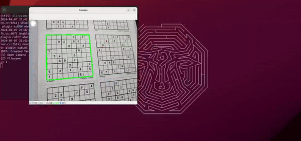
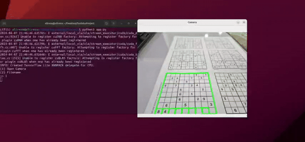
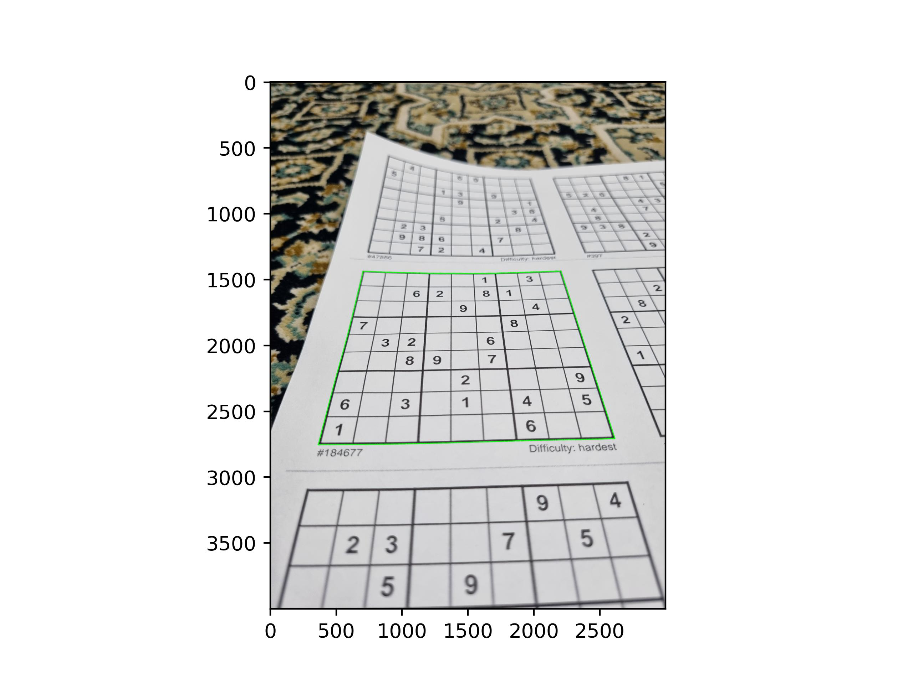
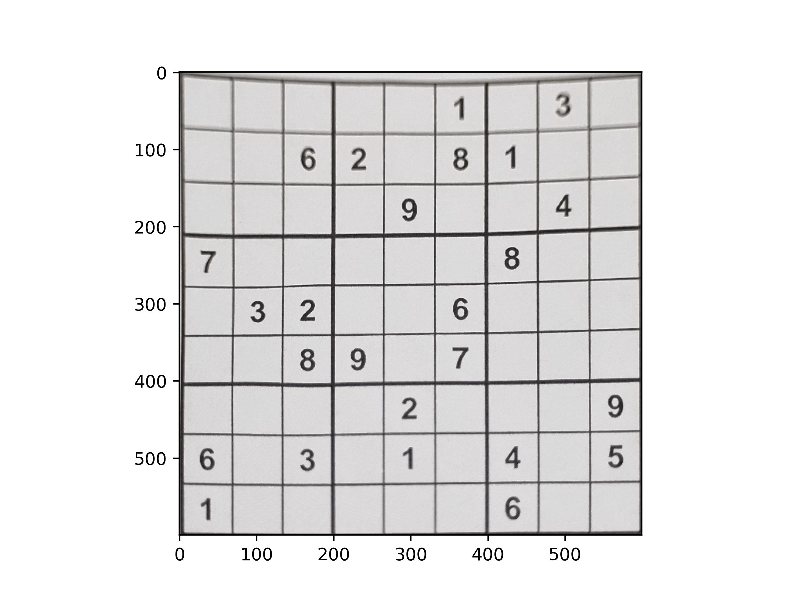
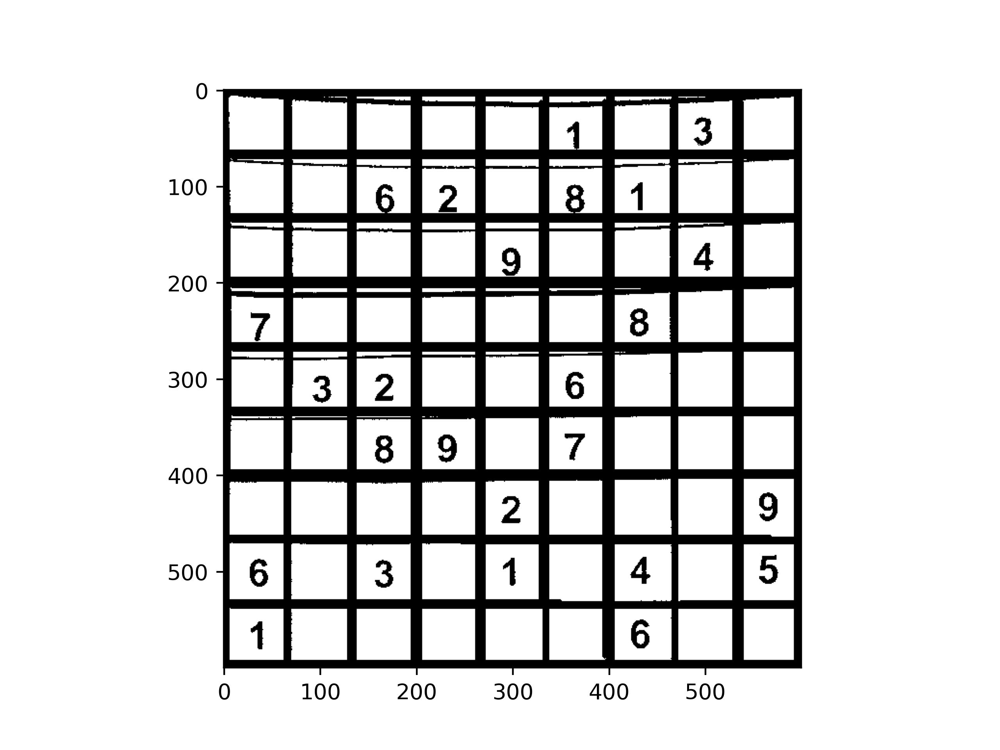
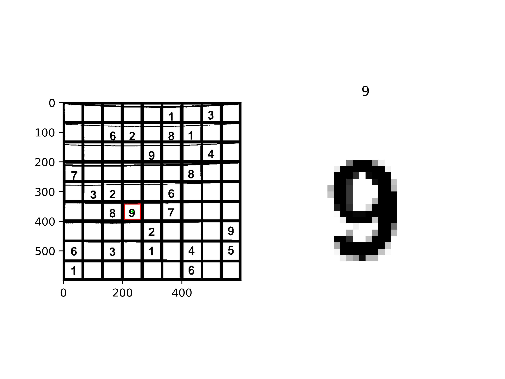
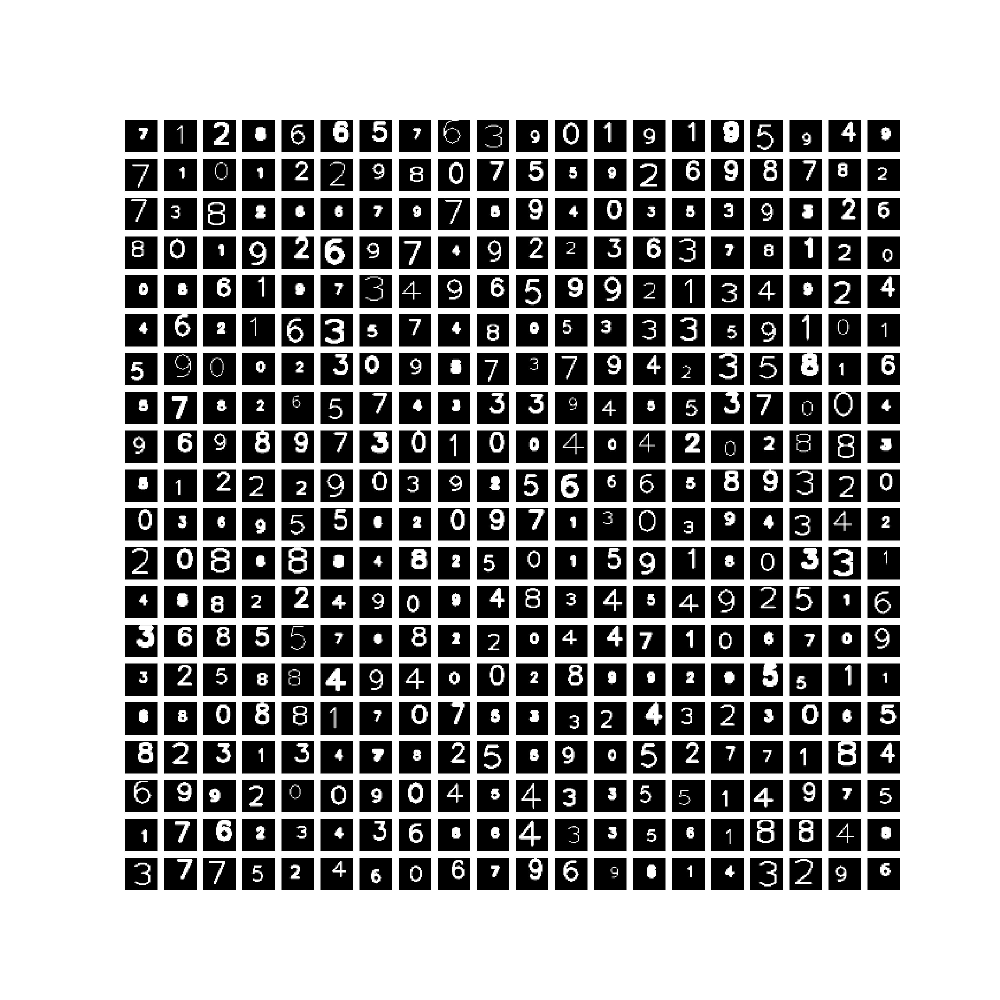
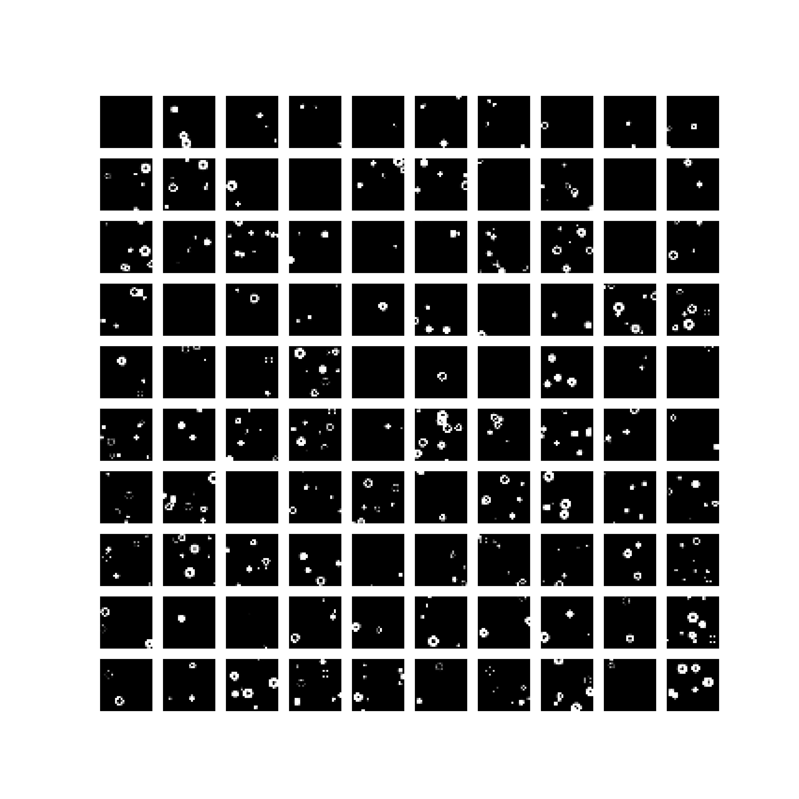
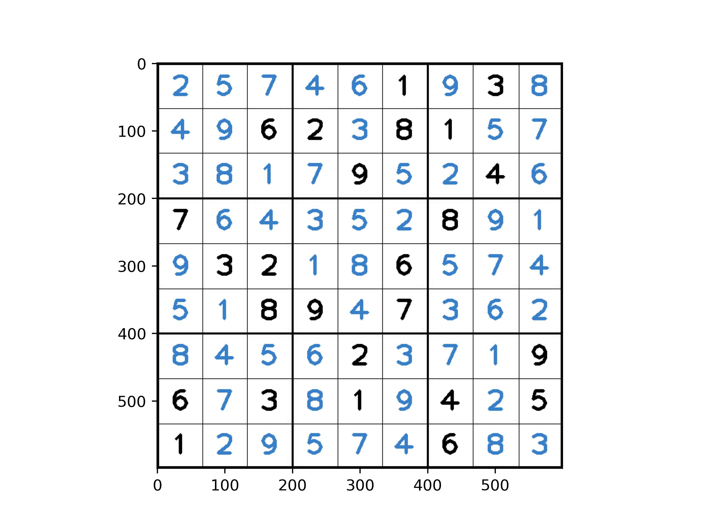

# Sudoku Computer Vision
## About this project
Sudoku is a popular form of number-game. Conventionally its board is set up with a 9 by 9 grid. The goal is to use numbers from 1 to 9 exactly once for each row, column and each 3 by 3 subgrids. A Sudoku puzzle should have exactly one solution.

This project uses computer vision algorithms to solve any Sudoku puzzles with any difficulty. The main purpose of this project hasn't been to find the solution for a given puzzle but to be able to use computer vision to parse the Sudoku grid and extract its values on to an array.

 

## Introduction
Parsing grids are often useful in various fields and applications like analysing datasheets, multi-choice examinations, form processing, survey analysis and etc. Ideas implemented in this project can be also used in applications mentioned.

This project follows a goal through several steps breaking it down to several subgoals. These subgoals are often crushal steps for most of the computer vision tasks.

The goal is achieved by following these steps:
- Find a contour that bounds the Sudoku grid
- Align the Sudoku grid
- Find contours associated with each cell in the grid
- Crop each cell and feed it to a Convolutional neural network to classify it
- Solve the Sudoku puzzle 

Although the ultimate goal is to find the parse the grid perfectly and efficiently in terms of running time and space.

## Find a contour that bounds the Sudoku grid
Some of the ideas here like this one specifically are very simple but efficient. Finding a contour that bounds the grid could be implemented via a DNN. However, we chose to just return the contour with maximum area; this idea is simple but efficient in terms of both running time and space complexity.

## Align the Sudoku grid
A contour gives us as much information we need as 4 points. Four corner points are enough to warp the perspective to align and crop the Sudoku grid

However, given that some of the lines are not straight and some may be discolored or fainted, we need a way to re-draw the lines so to be able to find contours easily. Many approaches have been taken like applying morphologies like CLOSING and CROSS to close the gap and rebuild the lines but they did not generalize well.

A template Sudoku grid has been loaded and composed with our main image. They should somewhat align since they are the same size (unless grid is not drawn conventionaly). Even if lines do not align perfectly, morphology would help us a bit.

Next, we used HoughLines algorithm to detect lines and draw them so to make the lines stronger.

As seen in this figure, lines are somewhat perfect; but some lines are seen to be out of line. We should not worry about them since they take up a small area and they should be ignored. 

## Find contours associated with each cell in the grid
Now one of the challenges is to find the contours associated with each grid in sorted order. We are interested in the order from top-left corner to bottom-right corner. 

Given a contour, we can find four points that bounds it (only if its shape is close to a rectangle or square). Given only top-left corner and bottom-right corner we can find the center of the square by:

$$
    Center(x, y) = (\frac{x_1 + x_2}{2}, \frac{y_1 + y_2}{2})
$$

Calculating a list of center points associated with their contour indices, we can sort the contours given their center points. However simply sorting by $(y, x)$ here is not practical. Since lines are not perfectly aligned we cannot rely on their center points to be aligned.

We address this issue by implementing an algorithm that tolarates some amount of differences between two pixels and returns their relative position and not just simply their coordinates.

Addressing this issue helped us generalize well on most of the test data.

## Train a CNN model
Another problem that we faced was to train a model that classifies the digits. One might think we could simply train a model with MNIST dataset and use it to classify each number in the cell.

First of all we have to address the problem of **empty** cells. Although we mostly see empty cells, they are not necessarily empty. They might have some kind of blobs, meaningless lines on them. So the second thing to address is this issue. Third of all, MNIST contains only handwritten digits, though useful, they come with the same size and they are in the center of the image whereas numbers in the Sudoku cells might not align well due to difference of perspective and angles the picture might be taken.

We addressed this issue with generating our own dataset. Since we only needed digital font, we could use *opencv* library to generate images randomly.

And also to address the issue of 10th class we generated a category of blobs as below

We generated $50000$ training images and $50000$ test images with numerical values and $10000$ training images and $10000$ test images with blobs along size MNIST dataset.

### Model
We trained a custom Resnet architecture with descriptions below:
| Layer (type)                        | Output Shape       | Param # |
| ----------------------------------- | ------------------ | ------- |
| conv_block (ConvBlock)              | (None, 28, 28, 64) | 1920    |
| maxpooling (MaxPooling2D)           | (None, 14, 14, 64) | 0       |
| res_block (ResBlock)                | (None, 7, 7, 128)  | 152896  |
| res_block (ResBlock)                | (None, 3, 3, 256)  | 608896  |
| global_avg (GlobalAveragePooling2D) | (None, 256)        | 0       |
| dropout (Dropout)                   | (None, 256)        | 0       |
| dense (Dense)                       | (None, 11)         | 2827    |
| act (Activation)                    | (None, 11)         | 0       |

Two *ResBlock*s defined each have 3 *ConvBlock* with filter sizes $[64, 64, 128]$ and $[128, 128, 256]$ respectively. Dropout rate is $0.7$

Total params: 766539 (2.92 MB)\
Trainable params: 764875 (2.92 MB)\
Non-trainable params: 1664 (6.50 KB)

### Evaluation
|              | precision | recall | f1-score | support |
| ------------ | --------- | ------ | -------- | ------- |
| 0            | 1.00      | 1.00   | 1.00     | 6031    |
| 1            | 1.00      | 1.00   | 1.00     | 6200    |
| 2            | 1.00      | 1.00   | 1.00     | 5967    |
| 3            | 1.00      | 1.00   | 1.00     | 5983    |
| 4            | 1.00      | 1.00   | 1.00     | 6006    |
| 5            | 0.99      | 1.00   | 1.00     | 6026    |
| 6            | 1.00      | 0.99   | 1.00     | 5815    |
| 7            | 1.00      | 1.00   | 1.00     | 5966    |
| 8            | 1.00      | 1.00   | 1.00     | 5848    |
| 9            | 1.00      | 1.00   | 1.00     | 6110    |
| 10           | 1.00      | 1.00   | 1.00     | 10000   |
|              |           |        |          |         |
| accuracy     |           |        | 1.00     | 69952   |
| macro avg    | 1.00      | 1.00   | 1.00     | 69952   |
| weighted avg | 1.00      | 1.00   | 1.00     | 69952   |

Models prediction time: $\approx 150ms$

## Solving the Sudoku puzzle
Finally, we can extract the numbers inside the image into an array and solve the Sudoku puzzle. Sudoku puzzle is then solved with a backtracking algorithm, trying out every value to solve the puzzle.

## Conclusion
Using mostly, simple computer vision algorithms we've been able to align the Sudoku grid, and take each cell so to feed it to a CNN. The only time we needed a deep neural network was when we were to classify numbers; and most of the work was done using *opencv* library. This being said, we achieved an efficient algorithm both in terms of running time and space complexity. Even our CNN runs in  $\approx 150ms$ with $\approx 2MB$ of memory.